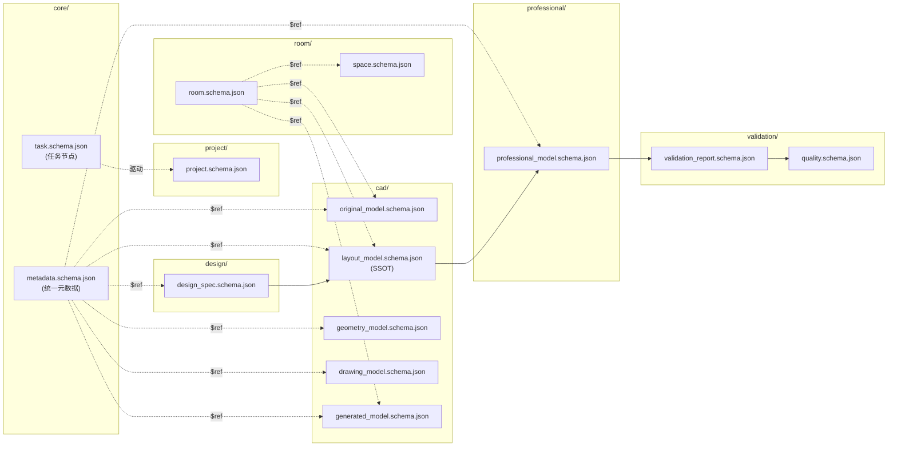
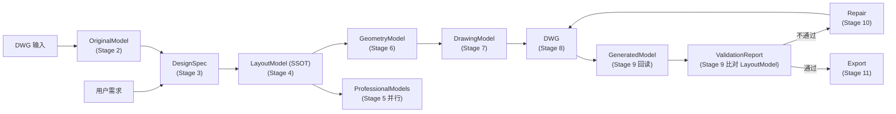

# SCHEMA_DESIGN

> **Schema Contract 设计文档**
>
> 本文档遵守 [`PROJECT_RULES.md`](PROJECT_RULES.md) **v1.1** 最高约束，并衔接 [`ARCHITECTURE.md`](architecture.md) **v1.1** 与 [`WORKFLOW.md`](WORKFLOW.md) **v1.0**。冲突时以 `PROJECT_RULES.md` 为准。
>
> 本文档版本：**v1.1（Schema Contract v1.1 · Hardening）**
> 本阶段为 **Phase 1.5：Schema Contract Hardening**，基于 `SCHEMA_REFACTOR_PLAN` 将契约升级为「可执行数据契约」：统一 metadata 通过 `$ref` 复用、补齐 ValidationReport / DesignSpec / ProfessionalModel、核心模型 `additionalProperties:false`、强化 LayoutModel SSOT（walls/doors/windows）。不修改总体架构，不新增 Agent，不接入 AutoCAD MCP。

---

## 1. Schema 关系图



> 说明：`core/metadata.schema.json` 与 `room/room.schema.json` 为「canonical 契约」，各模型 Schema 通过**相对 `$ref`**（如 `../core/metadata.schema.json`）复用，单一来源（SSOT）；`scripts/validate_schema.py` 自动扫描 `schemas/` 根目录构建 `referencing` Registry 解析跨文件 `$ref`，无需联网（见 §6）。`design_spec` 与 `professional_model` 为 Phase 1.5 新增契约。

---

## 2. 数据流说明



- 全链路以 JSON 模型通信，Agent 之间不直接传递 DWG 几何直觉，只传递结构化模型（PROJECT_RULES §4、architecture.md §4）。
- `LayoutModel` 在 Stage 4 后成为 **SSOT**，Stage 5–8 所有下游模型均派生自它（PROJECT_RULES §22）。

---

## 3. Agent 输入输出契约表

契约文件位于 `agents/<name>/agent_contract.json`。本阶段完成 9 个核心 Agent（其余专业深化 Agent 沿用相同契约模式，不在本阶段创建）。

| Agent | 输入 Schema | 输出 Schema | 关键能力 | 禁止项 |
|-------|------------|------------|---------|--------|
| orchestrator | ProjectInput, UserRequirement | Project, TaskGraph | orchestrate / plan / route / resolve_conflict | modify_DWG, modify_design, modify_layout, modify_drawing |
| parser | DWG, OriginalModel | OriginalModel | dwg_parse / input_analysis | modify_design, modify_layout, modify_drawing |
| design | UserRequirement, OriginalModel | DesignSpec | design_spec / style_planning / material_planning | modify_DWG, modify_layout |
| layout | DesignSpec | **LayoutModel (SSOT)** | space_layout / furniture_placement / constraint_build | modify_DWG, modify_drawing |
| geometry | LayoutModel | GeometryModel | geometry_generate / wall_geometry / dimension_chain | modify_design, modify_layout, modify_drawing |
| drawing | GeometryModel, LayoutModel | DrawingModel, DWG | drawing_generate / layer_map / dwg_export | modify_design, modify_layout |
| validator | LayoutModel, GeneratedModel, DrawingModel, ProfessionalModels | ValidationReport, Quality | validate / judge / spec_check | modify_design, modify_DWG, modify_layout, modify_drawing |
| repair | ValidationReport, FailedModel | RepairedModel | repair / regenerate / revalidate | modify_design_decision, modify_layout_decision |
| export | DWG, ValidationReport | Deliverable | export / final_check / archive | modify_DWG, modify_design, modify_layout, modify_drawing |

> `ProfessionalModels` = electrical / plumbing / lighting / ceiling / floor / elevation / construction 等 Stage 5 并行深化产物（本阶段仅定义契约模式，不创建这些 Agent）。

---

## 4. SSOT 说明（LayoutModel 单一可信源）

- `LayoutModel` 是整条链路唯一空间真相（PROJECT_RULES §22、architecture.md §8）。
- **仅描述空间**：包含 `version` / `rooms` / `furniture` / `constraints`，**禁止**包含 `cad_layer` / `dwg_entity` / `drawing_command`（Schema 中以 `allOf.not.required` 显式约束）。
- 下游 Agent（geometry / drawing / 各专业）**必须基于 LayoutModel 工作**，不得重新解释需求或自改设计（PROJECT_RULES §22.2）。
- 任何空间变更都应以**新版本 LayoutModel** 派生，而非直接改 DWG（architecture.md §13 Model First）。

---

## 5. Version 策略

- **LayoutModel 版本链**（architecture.md §8）：每次变更写入 `version`：
  - `model_version`：当前版本（v1 / v2 / v3 …）
  - `parent_version`：父版本（首版为 `none`）
  - `change_reason` / `changed_by`：变更原因与主体
  - `approval_status`：DRAFT → PENDING → APPROVED / REJECTED（须经 Human Approval，PROJECT_RULES §17）
  - `timestamp`：ISO 8601
- **输入版本声明**（architecture.md §14）：geometry / drawing 等下游 Agent 在其产物中声明所消费的 `layout_model_version` / `geometry_model_version`，确保可追溯与断点恢复（PROJECT_RULES §11）。其中 `GeometryModel` 额外声明 `geometry_model_version`，支持 **Geometry → Drawing** 版本追踪（Phase 1.5 新增）。
- **Schema 版本**：所有元数据含 `schema_version`（如 `1.0`），按 PROJECT_RULES §6.4 在契约变更时递增。
- **不可变模型**：OriginalModel / GeometryModel / DrawingModel / GeneratedModel 均为派生快照，重生成应产生新文件/新版本，不原地覆盖（PROJECT_RULES §4.4）。

---

## 6. 校验机制（Schema Validator）

脚本：`scripts/validate_schema.py`（JSON Schema **Draft 2020-12**）

```bash
# 校验单个数据文件
python3 scripts/validate_schema.py <schema.json> <data.json>

# 批量校验目录下全部 json
python3 scripts/validate_schema.py --schema <schema.json> --dir <examples_dir>
```

- 输出 `PASS: <path>` 或 `ERROR: <path> | <message>`。
- 退出码：`0` = 全部通过；`1` = 存在校验错误/用法错误。
- 各 Schema 通过相对 `$ref` 引用共享契约（metadata / quality / room），`validate_schema.py` 自动扫描 `schemas/` 根目录构建 `referencing` Registry 解析跨文件 `$ref`，无需联网或手动拼装。

---

## 7. 目录清单（Schema Contract v1.0）

```
schemas/
├── core/
│   ├── metadata.schema.json        # 统一元数据（canonical，被各模型 $ref 复用）
│   └── task.schema.json            # 任务节点（状态机）
├── project/
│   └── project.schema.json         # 工程状态（12 阶段枚举）
├── design/
│   └── design_spec.schema.json     # 设计方案说明（Stage 3，Phase 1.5 新增）
├── room/
│   ├── room.schema.json            # 房间空间定义（canonical）
│   └── space.schema.json           # 空间集合（rooms 引用 room.schema.json）
├── cad/
│   ├── original_model.schema.json  # DWG 解析原始空间
│   ├── layout_model.schema.json    # SSOT（含版本链，禁 CAD 表达，含 walls/doors/windows）
│   ├── geometry_model.schema.json  # Layout→CAD 几何中间层（含 geometry_model_version）
│   ├── drawing_model.schema.json   # CAD 表达（禁保存设计决策，dimension 契约）
│   ├── generated_model.schema.json # DWG 回读（Round-trip Compare）
│   └── drawing_model.json          # 历史文件名指针 → drawing_model.schema.json
├── professional/
│   └── professional_model.schema.json # 专业深化基础契约（Stage 5，Phase 1.5 新增）
├── validation/
│   ├── validation_report.schema.json # 校验报告（驱动 Repair Loop）
│   └── quality.schema.json
└── examples/
    ├── Metadata.example.json        # 统一元数据实例（core/metadata.schema.json）
    ├── LayoutModel.example.json     # 100㎡ 三居室（含 walls/doors/windows/quality）
    ├── GeometryModel.example.json   # 墙线/门/尺寸（含 geometry_model_version）
    ├── DrawingModel.example.json    # 图层/实体/标注（dimension 新契约）
    ├── GeneratedModel.example.json  # DWG 回读（Round-trip Compare）
    ├── OriginalModel.example.json   # DWG 解析原始空间（units/coordinates）
    ├── ValidationReport.example.json
    ├── DesignSpec.example.json
    └── ProfessionalModel.example.json

agents/<9 agent>/agent_contract.json   # 输入输出契约
scripts/validate_schema.py              # Draft 2020-12 校验器
```

---

## 8. 一致性声明（Consistency Statement）

`SCHEMA_DESIGN.md` v1.0 与 `PROJECT_RULES.md` v1.1、`ARCHITECTURE.md` v1.1、`WORKFLOW.md` v1.0 共同构成 Phase 1 数据层基础。若实现冲突，以 `PROJECT_RULES.md` 为准并同步修订本文档。

**提交标记：Schema Contract v1.1（Hardening）** —— 可作为下一阶段（Orchestrator 与 TaskGraph 第一个闭环）开发基础。
