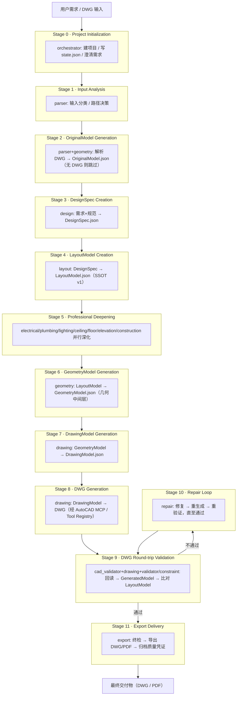

# WORKFLOW

> **业务流程定义文档（Business Workflow）**
>
> 本文件遵守 [`PROJECT_RULES.md`](PROJECT_RULES.md) **v1.1** 最高约束，并衔接 [`ARCHITECTURE.md`](architecture.md) **v1.1** 的架构约定；冲突时以 `PROJECT_RULES.md` 为准。
> 本文档仅定义**业务流程**，不创建 Agent / Skill / Schema（见 §0 范围约束）。
>
> 本文档版本：**v1.0**（Initial）

---

## 0. 范围约束（Scope）

本文件职责边界（PROJECT_RULES §2.1 分层、§3 单一职责）：

- **仅定义流程**：描述从"用户需求 / DWG 输入"到"最终交付"的业务阶段、责任主体与流转规则。
- **不创建模块**：不新增任何 Agent、Skill、Schema、Standard 实体；涉及的 Agent / Skill / Schema / Standard 名称均引用既有定义（见 `agents/`、`skills/`、`schemas/`、`standards/` 与 `architecture.md` §3、§4）。
- **不写死调用关系**：阶段间的实际调度由 Orchestrator 依据动态 Task Graph 生成（PROJECT_RULES §16、architecture.md §9），本文档给出的 Agent 为主责推荐，编排顺序可在运行时按需裁剪。

---

## 1. Workflow 总览

完整装修施工图生成流程，自下而上划分为 12 个标准阶段（Stage 0–11）。无 DWG 输入时从 `DesignSpec` 起步，有原始 DWG 时先解析为 `OriginalModel`，两条路径在 `LayoutModel`（SSOT）汇合（PROJECT_RULES §16、architecture.md §4）。

> 关键质量闭环：**Stage 8 生成的 DWG 不是终点**，必须经过 Stage 9 往返验证，禁止直接交付未验证 DWG（PROJECT_RULES §19.3）。
> 关键可信源：`LayoutModel.json` 在 Stage 4 成为 SSOT，Stage 5–8 所有下游 Agent 禁止重新解释需求或自改设计（PROJECT_RULES §22）。

---

## 2. 标准装修施工图 Workflow

> 阶段通用说明：
> - **Agent** 为主责 Agent；并行阶段由 Orchestrator 扇出调度（architecture.md §5）。
> - **Skills / Schemas / Standards** 引用 `skills/`、`schemas/`、`standards/` 下的分类目录；具体文件名以各目录与 `architecture.md` §3、§4 定义为准。
> - **Validation** 均要求 Schema 先校验后处理（PROJECT_RULES §6.3）与自检声明（PROJECT_RULES §12.1）。
> - **Failure Handling** 遵循失败重试（PROJECT_RULES §9）与状态机（PROJECT_RULES §13）。
> - **Human Approval** 依据关键阶段人工审核节点（PROJECT_RULES §17.1）：`Design` / `Layout` / `Construction` / `Final Drawing`。

---

### Stage 0

名称：Project Initialization（项目初始化）

目标：建立项目工作区，解析并归类用户输入，写入初始任务状态 `state.json`，对歧义需求发起澄清。

输入：用户需求文本 / 原始 DWG 文件

输出：
- `project_id`
- `workspace/projects/<id>/state.json`（初始状态 PENDING）
- 需求澄清记录（如存在歧义）

Agent：orchestrator

Skills：planning（初始化规划）、analysis（需求分析）

Schemas：schemas/core（项目元数据）、schemas/project

Standards：standards/naming（命名规范，PROJECT_RULES §5）

Validation：
- `project_id` 与 `state.json` 成功写入（PROJECT_RULES §11.1）
- 输入类型已被识别（DWG / 纯需求）

Failure Handling：
- 状态写入失败 → 指数退避重试（PROJECT_RULES §9.2），耗尽标记 `FAILED`（PROJECT_RULES §9.5）
- 需求歧义/缺失 → 进入 `WAITING_USER` 澄清（PROJECT_RULES §8.1），不可绕过

Human Approval：当输入存在歧义或缺失关键信息时需人工澄清（PROJECT_RULES §8.1）

---

### Stage 1

名称：Input Analysis（输入分析）

目标：对原始输入做初步解析与分类，判定是否具备可解析图纸，并决策后续路径（全量解析 或 从 DesignSpec 起步）。

输入：DWG 文件（可选） / 用户需求描述

输出：输入分类报告（含路径决策：有 DWG → Stage 2；无 DWG → 跳过 Stage 2 直入 Stage 3）

Agent：parser（+ orchestrator 路由）

Skills：analysis（输入分类）

Schemas：schemas/core、schemas/project

Standards：standards/naming

Validation：输入分类正确，路径决策已显式记录

Failure Handling：
- 输入无法识别或信息不足 → `WAITING_USER` 澄清（PROJECT_RULES §8）
- 输入识别异常 → 重试后上报 `FAILED`（PROJECT_RULES §9）

Human Approval：当输入歧义/缺失时需人工澄清（PROJECT_RULES §8.1）

---

### Stage 2

名称：OriginalModel Generation（原始模型生成）

目标：将原始 DWG 解析为结构化 `OriginalModel.json`，提取房间、墙体、门窗等基础几何；无 DWG 输入时**整体跳过**。

输入：DWG 文件

输出：OriginalModel.json（不可变中间产物，PROJECT_RULES §4.4）

Agent：parser + geometry

Skills：cad（DWG 解析）、analysis

Schemas：schemas/core、schemas/room、schemas/cad

Standards：standards/cad、standards/room

Validation：
- Schema 校验通过（PROJECT_RULES §6.3）
- 房间/墙体/门窗几何自洽，坐标单位 mm（PROJECT_RULES §4.5）

Failure Handling：
- 解析失败（DWG 损坏/格式不支持）→ `RETRYING` 指数退避（PROJECT_RULES §9.2），耗尽标记 `FAILED` 并保留现场（PROJECT_RULES §9.5）
- 不可重试错误 → 立即中止上报 Orchestrator（PROJECT_RULES §9.3）

Human Approval：否

---

### Stage 3

名称：DesignSpec Creation（设计方案说明创建）

目标：基于用户需求（及可选的 OriginalModel）生成 `DesignSpec.json`，确定风格、功能分区、材质意向与规范选择。

输入：用户需求 + OriginalModel.json（可选）

输出：DesignSpec.json

Agent：design

Skills：planning（方案规划）

Schemas：schemas/core、schemas/project

Standards：standards/room、standards/furniture、standards/construction

Validation：
- 规范选择明确（国标 / 地标），字段完整（PROJECT_RULES §6.3）
- 输出附带质量声明 `validation_passed`（PROJECT_RULES §18.1）

Failure Handling：
- 规范冲突（如地方标准 vs 国标）→ `WAITING_USER` 澄清（PROJECT_RULES §8.2）
- Schema 校验失败 → 立即中止上报（PROJECT_RULES §9.3）

Human Approval：**是**（Design 为关键阶段，PROJECT_RULES §17.1）；审核通过后方可进入 Stage 4

---

### Stage 4

名称：LayoutModel Creation（布局模型创建 · SSOT）

目标：基于 `DesignSpec` 生成 `LayoutModel.json`，建立整条链路的**唯一可信空间模型（SSOT）**，含房间布局、墙体、门窗、家具定位，并写入版本元数据（v1）。

输入：DesignSpec.json（+ OriginalModel.json）

输出：LayoutModel.json（SSOT，model_version=v1，含版本元数据，PROJECT_RULES §22、architecture.md §8）

Agent：layout

Skills：planning、analysis

Schemas：schemas/core、schemas/room、schemas/cad

Standards：standards/room、standards/furniture、standards/construction、standards/naming

Validation：
- Schema 校验通过（PROJECT_RULES §6.3）
- 按 `checklist.md` 自检并产出验证声明（PROJECT_RULES §12.1）
- 版本元数据完整（parent_version / approval_status，architecture.md §8）

Failure Handling：
- 校验失败 → 退回 Stage 3（design）或 `WAITING_USER`
- 不可重试错误 → 中止上报（PROJECT_RULES §9.3）

Human Approval：**是**（Layout 为关键阶段，PROJECT_RULES §17.1）；审核通过且 `approval_status=APPROVED` 后方可作为 SSOT 下游使用

---

### Stage 5

名称：Professional Deepening（专业深化）

目标：基于 `LayoutModel`（SSOT）由 Orchestrator 并行调度各专业 Agent，深化各专业施工图数据；所有 Agent 禁止重新解释需求或自改设计（PROJECT_RULES §22.2）。

输入：LayoutModel.json（各 Agent 须声明所使用 LayoutModel 版本，architecture.md §14）

输出（各专业模型，均不可变）：
- ElectricalModel（electrical）
- PlumbingModel（plumbing）
- LightingModel（lighting）
- CeilingModel（ceiling）
- FloorModel（floor）
- ElevationModel（elevation）
- ConstructionModel（construction）

Agent（并行扇出，orchestrator 调度）：electrical、plumbing、lighting、ceiling、floor、elevation、construction

Skills：mep（机电）、cad、drawing

Schemas：schemas/core、schemas/cad、schemas/room

Standards：standards/electrical、standards/plumbing、standards/lighting、standards/construction、standards/cad

Validation：
- 各专业按 `checklist.md` 自检（PROJECT_RULES §12.1）
- 不重新解释需求、不重推导方案（PROJECT_RULES §22.2）
- 跨专业冲突由 validator / constraint / cad_validator 裁决（PROJECT_RULES §3.4）

Failure Handling：
- 专业冲突 → 汇聚至 validator / constraint 裁决（PROJECT_RULES §3.4），必要时退回上游
- 单专业校验失败 → `REPAIRING` 或退回对应 Agent（PROJECT_RULES §12.2）

Human Approval：**是**（Construction 为关键阶段，PROJECT_RULES §17.1）；ConstructionModel 审核通过后方可进入下游

---

### Stage 6

名称：GeometryModel Generation（几何模型生成）

目标：将 `LayoutModel` 转换为几何中间层 `GeometryModel.json`，承载空间几何转换、墙体几何、门窗/家具定位、尺寸链、标注基准与 CAD 绘图基础数据（architecture.md §4）。

输入：LayoutModel.json（须声明版本，architecture.md §14）

输出：GeometryModel.json（不可变）

Agent：geometry

Skills：cad、analysis

Schemas：schemas/core、schemas/cad、schemas/room

Standards：standards/cad、standards/room

Validation：
- Schema 校验通过（PROJECT_RULES §6.3）
- 坐标单位 mm、面积 m²、角度 °（PROJECT_RULES §4.5）
- 与 LayoutModel 空间关系一致（PROJECT_RULES §22.2）

Failure Handling：
- 几何不一致 → 退回 Stage 4（layout）重生成新版本（PROJECT_RULES §22.3）
- 校验失败 → 重试 / 上报（PROJECT_RULES §9）

Human Approval：否

---

### Stage 7

名称：DrawingModel Generation（绘图模型生成）

目标：基于 `GeometryModel` 生成 `DrawingModel.json`，承载 CAD 图层映射、图元组织、标注规则与图框配置，避免 Drawing Agent 直接操作 `LayoutModel`（architecture.md §4、§13）。

输入：GeometryModel.json（声明版本）+ LayoutModel.json 版本（声明输入版本，architecture.md §14）

输出：DrawingModel.json（不可变；含 sheets / layers / entities / annotations / dimensions / blocks / titleblock，schemas/cad/drawing_model.json）

Agent：drawing

Skills：cad、drawing

Schemas：schemas/cad/drawing_model.json、schemas/core

Standards：standards/cad、standards/printing、standards/naming

Validation：
- Schema 校验通过（PROJECT_RULES §6.3）
- 不直接改写 LayoutModel（PROJECT_RULES §22）
- 图层命名遵循 standards/cad（PROJECT_RULES §7.3）

Failure Handling：
- 校验失败 → 退回 Stage 6（geometry）
- 不可重试错误 → 中止上报（PROJECT_RULES §9.3）

Human Approval：否（Final Drawing 审核置于 Stage 8）

---

### Stage 8

名称：DWG Generation（DWG 生成）

目标：基于 `DrawingModel.json`，通过经 Tool Registry 注册的 AutoCAD 自动化接口（AutoCAD MCP / API）生成最终 DWG，包含图元、图层、标注与图框。

输入：DrawingModel.json + templates/cad（仅复制只读副本，PROJECT_RULES §20）

输出：DWG 文件（图别前缀 P/E/W/L/C/V/F/D，PROJECT_RULES §5.3）

Agent：drawing

Skills：cad、drawing

Schemas：schemas/cad/drawing_model.json、schemas/template

Standards：standards/cad（图层命名 §7.3）、standards/printing、standards/naming

Validation：
- 图元来源（agent / task_id）写入 XData，保证可追溯（PROJECT_RULES §7.6）
- 每次 MCP 调用幂等可重放（PROJECT_RULES §7.4），支持断点恢复
- 调用前确认模板来自 templates/cad（PROJECT_RULES §7.2）

Failure Handling：
- MCP 超时/异常 → 指数退避重试（PROJECT_RULES §9.2），连续失败上报 Orchestrator（PROJECT_RULES §7.5）
- 模板缺失 → 中止上报，禁止自行发明图层（PROJECT_RULES §7.3）

Human Approval：**是**（Final Drawing 为关键阶段，PROJECT_RULES §17.1）；审核通过后方可进入 Stage 9 验证

---

### Stage 9

名称：DWG Round-trip Validation（DWG 往返验证）

目标：重新打开生成的 DWG，解析回 `GeneratedModel.json`，与 `LayoutModel.json`（SSOT）比对，完成文件级与模型级双重验证（PROJECT_RULES §19、architecture.md §12）。

输入：Stage 8 生成的 DWG + LayoutModel.json（SSOT）

输出：
- GeneratedModel.json（DWG 回读，不可变）
- 校验报告（文件级 + 模型级）

Agent（主导）：cad_validator（+ drawing 回读解析 + validator / constraint 合规裁决）

Skills：validation、cad

Schemas：schemas/cad、schemas/validation

Standards：standards/cad、standards/printing

Validation：
- **文件级**：DWG 可打开、图层完整、图框存在、标注样式正确
- **模型级**：GeneratedModel 与 LayoutModel 的房间数量、房间边界、墙体位置、门窗位置、尺寸、空间关系一致（architecture.md §12）
- 校验基于 schemas/ 与 standards/ 机器可读规则（PROJECT_RULES §12.3）

Failure Handling：
- DWG 无法打开 或 GeneratedModel ≠ LayoutModel → 标记 `FAILED` → 进入 Stage 10（Repair Loop）
- 禁止直接人工修改 DWG 绕过模型（PROJECT_RULES §19.3、§22）

Human Approval：否

---

### Stage 10

名称：Repair Loop（修复循环）

目标：依据 Stage 9 的失败报告自动修复，重新生成并重验证，直至通过 Round-trip；仍失败时上报 Orchestrator 决策。

输入：Stage 9 校验失败报告 + 失败模型 / DWG

输出：修复后的模型与 DWG（新版本，不可变，PROJECT_RULES §4.4）

Agent（主导）：repair（+ 相关 Agent 按需重执行对应阶段）

Skills：cad、drawing、validation

Schemas：schemas/validation、schemas/cad

Standards：standards/cad、standards/printing

Validation：
- 修复后重新执行 Stage 9 往返验证并 `validation_passed=true`（PROJECT_RULES §18.2、§19）
- 修复后重新评估质量评分（PROJECT_RULES §18.3）

Failure Handling：
- 仍失败 → 上报 Orchestrator，可转入 `WAITING_USER`（§18.2）或退回上游重生成（§22.3）
- 重试耗尽保留现场（PROJECT_RULES §9.5）

Human Approval：当修复质量 `confidence` 不足或 `quality_score` 低于阈值时，转入 `WAITING_USER` 由人工决策（PROJECT_RULES §18.2）

---

### Stage 11

名称：Export Delivery（导出交付）

目标：对通过往返验证的 DWG 执行四项终检，导出最终交付物（DWG / PDF），并将质量凭证一并归档。

输入：已验证 DWG + Stage 9/10 校验报告 + 质量评分（PROJECT_RULES §18）

输出：
- 交付物：DWG / PDF（命名合规，PROJECT_RULES §5.3）
- 归档：质量凭证至 `workspace/output/`（PROJECT_RULES §12.5）

Agent：export

Skills：export

Schemas：schemas/validation、schemas/project

Standards：standards/printing、standards/naming

Validation（四项终检，PROJECT_RULES §12.4）：
- 文件可打开
- 图层完整
- 图框正确
- 命名合规

全部通过方可标记 `DELIVERED`。

Failure Handling：
- 终检任一项不通过 → 退回 Stage 10（Repair）重新验证
- 导出异常 → 重试 / 上报（PROJECT_RULES §9）

Human Approval：否（Final Drawing 审核已在 Stage 8 完成）

---

## 3. 流程约束摘要（Compliance Summary）

| 约束项 | 对应规则 | 在 Workflow 中的体现 |
|--------|----------|----------------------|
| 单一可信源 SSOT | §22、architecture.md §8 | Stage 4 生成 LayoutModel，Stage 5–8 仅消费不重写 |
| DWG 往返验证 | §19、architecture.md §12 | Stage 9 强制回读比对，禁止未验证交付 |
| Model First | §19、§22、architecture.md §13 | Stage 6→7→8 模型链，禁止 Drawing-First |
| 人工审核节点 | §17.1 | Stage 3/4/5/8 设 Human Approval |
| 任务状态机 | §13 | 各 Stage Failure Handling 引用状态迁移 |
| 失败重试 | §9 | 各 Stage 指数退避 / 中止上报 |
| 断点恢复 | §11 | state.json 续跑，MCP 幂等 |
| 模板只读 | §20 | Stage 8 仅复制 templates/cad 副本 |
| 动态工作流 | §16、architecture.md §9 | §0 声明编排可裁剪，最小路径 |
| 能力声明 / 版本声明 | §14、architecture.md §14 | Stage 5–8 声明 LayoutModel/GeometryModel 版本 |
| JSON Schema 校验 | §6 | 所有 Stage 入口先校验后处理 |
| 质量评分 | §18 | Stage 3/9/10/11 附带 quality 声明 |

---

## 4. 一致性声明（Consistency Statement）

本 `WORKFLOW.md` 版本 **v1.0**，与 [`PROJECT_RULES.md`](PROJECT_RULES.md) v1.1 及 [`ARCHITECTURE.md`](architecture.md) v1.1 共同构成顶层流程定义。模块实现若冲突，以 `PROJECT_RULES.md` 为准并同步修订本文档。
