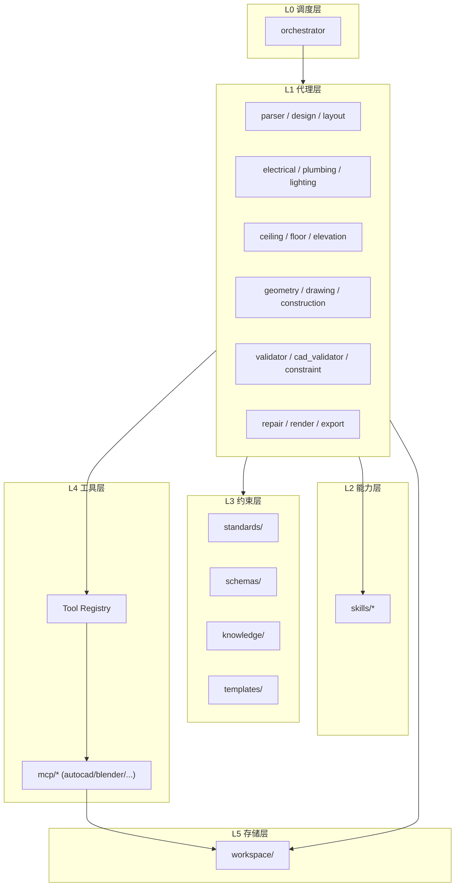
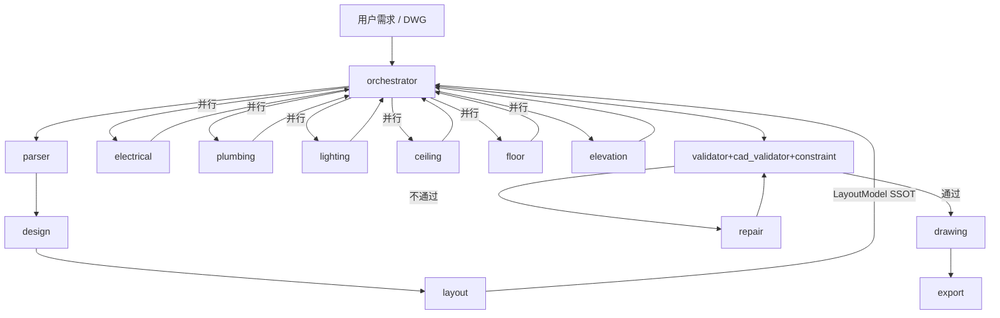
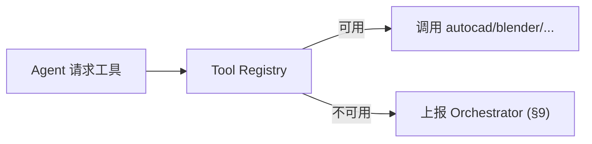
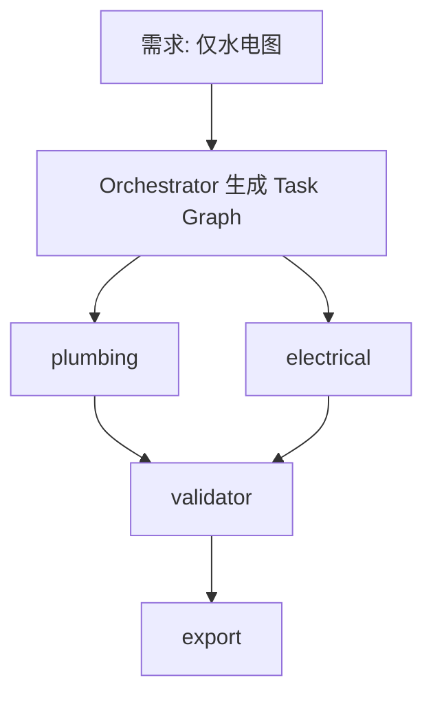
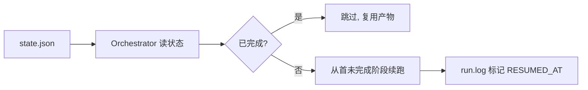
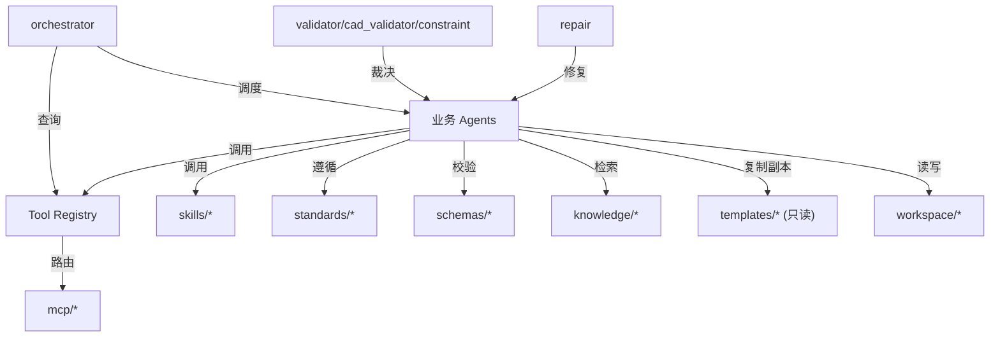
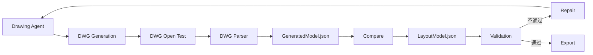

# ARCHITECTURE

> **系统架构说明文档（System Architecture）**
>
> 本文件遵守 [`PROJECT_RULES.md`](PROJECT_RULES.md) **v1.1** 最高约束；所有架构决策标注对应规则章节，且不得与之冲突。冲突时以 `PROJECT_RULES.md` 为准。
>
> 本文档版本：**v1.2**（ARCHITECTURE Patch v1.2：新增 §16 Professional Deepening Framework（Phase 5，并行专业深化）；v1.1：LayoutModel Version Chain / GeometryModel 增强 / CAD Round-trip / DrawingModel）。

---

## 1. 系统总体目标

`InteriorDesignOS` 是由多智能体协作驱动的室内设计自动化操作系统，目标是把"原始资料 / 用户需求 → 全套专业施工图纸与交付物"的链路标准化、可复用、可验证。

- 每份产出可追溯、可校验、符合现行国家与行业规范（PROJECT_RULES §1.2）。
- 不牺牲合规性的前提下最大化并行与自动化（PROJECT_RULES §1.3）。
- 通过 `standards/`、`knowledge/`、`schemas/`、`skills/` 分层沉淀使能力可演进（PROJECT_RULES §1.4）。
- 具备动态工作流、断点恢复、单一可信源三大工程韧性（PROJECT_RULES §11、§16、§22）。

---

## 2. 分层架构

系统自上而下六层，**上层可调用下层，下层不得反向依赖上层**（PROJECT_RULES §2.1）。



| 层 | 目录 | 职责 |
|----|------|------|
| L0 调度层 | `agents/orchestrator/` | 解析需求、动态生成 Task Graph、维护状态机、汇总与冲突裁决 |
| L1 代理层 | `agents/*` | 各专业设计/计算/校验/出图，单一职责（PROJECT_RULES §3） |
| L2 能力层 | `skills/*` | 可复用原子能力封装 |
| L3 约束层 | `standards/`、`schemas/`、`knowledge/`、`templates/` | 规范、数据契约、知识、只读模板 |
| L4 工具层 | `mcp/`、`Tool Registry` | 经注册表的外部工具 |
| L5 存储层 | `workspace/` | 项目数据/缓存/临时/输出/归档（PROJECT_RULES §4.4） |

---

## 3. 各目录职责

| 目录 | 职责 | 规则 |
|------|------|------|
| `agents/` | 19 个代理，每目录固定 10 标准文件 | §5.2 |
| `skills/` | 跨代理复用能力（cad/drawing/validation/render/export/analysis/planning/mep/utility） | §2.2 |
| `schemas/` | JSON Schema（core/room/cad/project/validation/template） | §6 |
| `standards/` | 行业与国家规范（cad/construction/room/electrical/plumbing/lighting/furniture/printing/naming） | §2.2 |
| `templates/` | **只读** CAD 模板、图框/图层/样式 | §20 |
| `knowledge/` | 专业知识库，文件须含元数据 | §21 |
| `reference/` | 样例图纸/项目/国标/图层示例/图框/检查清单 | — |
| `mcp/` | 工具连接器（autocad/blender/3dsmax/photoshop/future） | §15 |
| `workspace/` | 运行时数据：`projects/`(含 state.json)、`cache/`、`temp/`、`output/`、`archive/` | §4、§11 |
| `tests/` | 代理/修复/回归测试 | §12.3 |
| `examples/` | 户型示例（apartment/villa/duplex/office/commercial） | — |
| `scripts/` | 工程化辅助脚本 | — |
| `logs/` | 系统级与任务级日志 | §10 |
| `docs/` | 架构/流水线/开发/API 文档 | — |
| `.codex/` | 运行环境/启动流程/系统设置 | — |

---

## 4. 核心数据流

```mermaid
flowchart LR
    A["DWG (输入)"] --> B["OriginalModel.json<br/>(parser+geometry)"]
    B --> C["DesignSpec.json<br/>(design)"]
    C --> D["LayoutModel.json<br/>(layout · SSOT)"]
    D --> E["GeometryModel.json<br/>(geometry 几何层)"]
    E --> F["DrawingModel<br/>(drawing: 图层/图元/标注/图框)"]
    F --> G["DWG<br/>(drawing 生成)"]
    G --> H["GeneratedModel.json<br/>(回读解析)"]
    H --> I["Validation<br/>(compare+cad_validator+repair)"]
    I --> J["Export (export DWG/PDF)"]
```



| 阶段 | 主责 Agent | 输出 | 规则 |
|------|-----------|------|------|
| OriginalModel | `parser`+`geometry` | `OriginalModel.json` | §6 |
| DesignSpec | `design` | `DesignSpec.json` | §22.1 |
| LayoutModel | `layout` | `LayoutModel.json` (SSOT) | §22 |
| GeometryModel | `geometry` | `GeometryModel.json`（空间几何转换/墙体几何/门窗定位/家具定位/尺寸链/标注基准/CAD 基础数据） | §22.2 |
| DrawingModel | `drawing` | `DrawingModel.json`（sheets/layers/entities/annotations/dimensions/blocks/titleblock） | §7、§20、§12、§13 |
| DWG | `drawing` | DWG | §7、§20、§13 |
| GeneratedModel | `drawing`+`cad_validator` | `GeneratedModel.json`（DWG 回读） | §13、§19 |
| Validation | `cad_validator`/`validator`/`repair` | 校验报告+修复模型 | §12、§18、§19 |
| Export | `export` | 终检交付物 | §12.4、§19.3 |

> 无 DWG 输入时流程从 `DesignSpec` 起步；有原始 DWG 时先解析为 `OriginalModel`。两条路径在 `LayoutModel` 汇合（PROJECT_RULES §16）。
>
> `GeometryModel` 是 `LayoutModel` 到 DWG 的中间几何层，承载空间几何转换、墙体几何、门窗/家具定位、尺寸链、标注基准与 CAD 绘图基础数据；`DrawingModel` 避免 Drawing Agent 直接操作 `LayoutModel`，承载 CAD 图层映射、图元组织、标注规则与图框配置（PROJECT_RULES §22）。

---

## 5. Agent 之间的调用关系

- **唯一入口**：`orchestrator` 是入口与汇聚点，业务 Agent 不直接互调，仅经 Orchestrator 路由（PROJECT_RULES §2.3、§4.2）。
- **扇出并行**：`LayoutModel` 就绪后，`electrical`/`plumbing`/`lighting`/`ceiling`/`floor`/`elevation` 由 Orchestrator 并行调度。
- **汇聚校验**：深化产物汇总至 `validator`+`cad_validator`+`constraint` 裁决，业务 Agent 不做最终合规判定（PROJECT_RULES §3.4）。
- **修复闭环**：不通过进入 `repair`，仍失败则上报（PROJECT_RULES §9、§18.3）。



---

## 6. JSON 数据流

所有 Agent 间数据须为符合 `schemas/` 的 JSON 对象（PROJECT_RULES §4.1），并携带最小元数据（PROJECT_RULES §4.3）：

```json
{
  "project_id": "Project_001",
  "agent": "layout",
  "task_id": "task-7f3a",
  "timestamp": "2026-07-22T10:00:00+08:00",
  "schema_version": "1.0",
  "status": "COMPLETED",
  "payload": { "layout_model_ref": "workspace/projects/Project_001/output/LayoutModel.json" },
  "quality": { "confidence": 0.97, "quality_score": 93, "validation_passed": true }
}
```

- 不可变中间产物：写入 `workspace/output/` 后不可变，修订须生成新版本（PROJECT_RULES §4.4）。
- 先校验后处理：入口按 Schema 校验，失败进重试/上报（PROJECT_RULES §6.3）。
- `status` 取值来自第 13 节 Task State Machine。

---

## 7. Tool Registry 的作用

所有外部工具（AutoCAD MCP、Blender、3ds Max、SketchUp、Photoshop、Computer Use、Revit 等）须统一注册于 **Tool Registry**（PROJECT_RULES §15）：

- **可用性仲裁**：调用前先查 Registry，禁止直接假设工具存在。
- **解耦实现**：架构不写死具体 CAD 工具，新增工具仅需注册（PROJECT_RULES §7.1）。
- **衔接能力声明**：与 Agent Capability（PROJECT_RULES §14）共同支撑动态调度。
- **失败可观测**：工具不可用按重试/上报处理，不静默 fallback（PROJECT_RULES §9、§15.3）。



---

## 8. Single Source of Truth（LayoutModel.json）

`LayoutModel.json` 是整条链路的**唯一可信空间模型**（PROJECT_RULES §22）：

- `DesignSpec.json` 与 `LayoutModel.json` 验证完成后，`LayoutModel.json` 即为 SSOT。
- 后续所有 Agent（`Geometry`/`Drawing`/`Construction`/`Electrical`/`Plumbing`/`Lighting`/`Export` 等）**禁止重新解释需求、禁止重推导方案、禁止自改设计**，必须基于 `LayoutModel.json`。
- 下游发现问题须退回 `Design`/`Layout` 重生成，不得在下游自行修正。
- 空间模型变更只能经 `Design`/`Layout` + 人工审核（PROJECT_RULES §17）产生新版本，下游据此刷新。
- DWG 往返验证（PROJECT_RULES §19）将生成 DWG 解析回 `GeneratedModel.json` 与 `LayoutModel.json` 比对，确保未偏离 SSOT。

### LayoutModel Version Chain

`LayoutModel.json` 是空间模型唯一可信源，但**禁止覆盖历史版本**；任何空间模型变更必须生成新版本（PROJECT_RULES §4.4、§22）：

```
LayoutModel_v1.json → LayoutModel_v2.json → LayoutModel_v3.json
```

每个版本须包含版本元数据：

```json
{
  "model_version": "v2",
  "parent_version": "v1",
  "change_reason": "modify living room layout",
  "changed_by": "layout_agent",
  "approval_status": "APPROVED",
  "timestamp": "2026-07-22T10:00:00"
}
```

规则：
- 禁止覆盖旧 `LayoutModel`；新版本必须记录父版本。
- 版本变化必须经过 Human Approval（PROJECT_RULES §17）。
- 所有下游 Agent 必须声明使用的 `LayoutModel` 版本（见 §14）。
- 历史版本永久保留，用于回溯。

---

## 9. 动态 Task Graph

Workflow 不固定，Orchestrator 据以下因素动态生成 **Task Graph**（PROJECT_RULES §16）：用户需求、当前任务与已完成阶段、Agent 能力（§14）、Tool 可用性（§15）。

原则：**最小化执行路径**。例如仅要求水电图时，Task Graph 仅含 `plumbing`/`electrical`+校验+导出，不触发全量流程。



---

## 10. 断点恢复机制

长流程支持断点续跑，状态外置（PROJECT_RULES §11）：

- 启动写 `workspace/projects/<id>/state.json`，按第 13 节状态机原子更新。
- 中断重启后 Orchestrator 读取 `state.json`：**已完成阶段跳过，从首未完成阶段续跑**，复用不可变产物（PROJECT_RULES §4.4）。
- 上游产物丢失则重算该上游，不影响已验证下游。
- MCP 绘图指令须幂等（PROJECT_RULES §7.4），续跑不重复生成图元/图层。
- 恢复后 `run.log` 标记 `RESUMED_AT <timestamp>`（PROJECT_RULES §10、§11.5）。



---

## 11. 模块依赖关系

依赖方向遵循分层解耦（PROJECT_RULES §2.1）与单一职责（PROJECT_RULES §3）：



关键约束：
- 下游不反向依赖上游；Skills/Standards 不依赖具体 Agent（PROJECT_RULES §2.1）。
- 约束层纯被消费方。
- 最小可信依赖：每 Agent 只依赖所需标准/Schema/工具，新增须登记于 `agent/*.md`（PROJECT_RULES §2.4）。
- 模板只读：仅"复制副本"使用，不得写回（PROJECT_RULES §20）。

---

## 12. CAD Round-trip Architecture

CAD 输出不是流程终点。所有 DWG 必须经过完整往返验证闭环（PROJECT_RULES §19）：



**文件级验证**：DWG 是否可打开、是否损坏、图层是否完整、图框是否存在、标注样式是否正确。
**模型级验证**：比较 `GeneratedModel.json` 与 `LayoutModel.json` 的房间数量、房间边界、墙体位置、门窗位置、尺寸、空间关系。

**失败处理**：
- DWG 无法打开 → `FAILED` → Repair Agent → 重新生成。
- `GeneratedModel != LayoutModel` → Validation FAILED → Repair → 重新 Drawing → 重新验证。
- **禁止直接人工修改 DWG 绕过模型**（PROJECT_RULES §19.3、§22）。

---

## 13. CAD 数据闭环原则（Model First）

CAD 系统必须遵循 **Model First, Not Drawing First**（PROJECT_RULES §19、§22）：

- 禁止：`Agent → 直接画 CAD → 认为完成`。
- 必须：`结构化模型 → 几何模型 → CAD 图元 → 回读验证 → 交付`。

任何 CAD 图纸必须能够解释其来源（PROJECT_RULES §7.6、§10.3）：
- 来自哪个模型（`LayoutModel` / `GeometryModel` 版本）
- 哪个 Agent 生成
- 哪次任务（`task_id`）

---

## 14. Agent 输入版本声明

所有 Agent 执行任务时必须声明输入版本（PROJECT_RULES §4.3、§22）：

```json
{
  "agent": "drawing",
  "input": {
    "layout_model_version": "v3",
    "geometry_model_version": "v2"
  }
}
```

- 禁止 Agent 使用未知版本数据。
- 下游 Agent 必须声明其所基于的 `LayoutModel` / `GeometryModel` 版本，确保与 SSOT 版本链一致（见 §8 LayoutModel Version Chain）。

---

## 15. 一致性声明

本架构文档版本 **v1.2**，与 [`PROJECT_RULES.md`](PROJECT_RULES.md) v1.1 共同构成顶层约束。模块实现若冲突，以 `PROJECT_RULES.md` 为准并同步修订本文档。

---

## 16. Professional Deepening Framework（Phase 5）

> 详细规范见 [`PROFESSIONAL_FRAMEWORK.md`](PROFESSIONAL_FRAMEWORK.md)。本节为架构级摘要。

### 16.1 定位与约束

`professional/` 为专业深化层，包含 8 个 Professional Agent（Mock Logic）：
Electrical / Plumbing / Lighting / Ceiling / Flooring / HVAC / Construction / Furniture。

- Professional Agent **只能读取** `LayoutModel`（SSOT，§8）与 `DesignSpec`（只读引用）。
- **禁止**修改 `LayoutModel` / `DesignSpec`；**禁止**直接操作 DWG / 调用 AutoCAD MCP / 调用外部 AI。
- 所有 Agent 继承 `professional/base/professional_agent.py::BaseProfessionalAgent`，
  公共逻辑（load_layout / load_design_spec / validate_input / generate_model /
  export_model / quality_check）不得重复实现。

### 16.2 数据流（Parallel Fan-out / Fan-in）

```text
LayoutModel（SSOT，只读）
   │  Parallel Fan-out（Orchestrator.run_professional_stage）
   ├─ ElectricalAgent ──► ElectricalModel
   ├─ PlumbingAgent  ──► PlumbingModel
   ├─ LightingAgent  ──► LightingModel
   ├─ CeilingAgent   ──► CeilingModel
   ├─ FlooringAgent  ──► FlooringModel
   ├─ HVACAgent      ──► HVACModel
   ├─ ConstructionAgent ► ConstructionModel
   └─ FurnitureAgent ──► FurnitureModel
   │  Parallel Fan-in（等待全部完成；失败者可单独重跑）
   ▼
ProfessionalValidator（聚合校验：Schema / 版本 / LayoutVersion / Quality）
   ▼
Export（professional_export_manifest.json + 校验报告 + 检查点）
```

### 16.3 统一契约

所有专业模型遵循公共 Schema `schemas/professional/professional_model.schema.json`：
`metadata / layout_model_version / discipline / objects / constraints / quality`。
`layout_model_version` 必须与 SSOT 版本链一致（§8、§14）。

### 16.4 Runtime 支撑

- `runtime/parallel.py::ParallelStageRunner`：通用并行阶段执行器，支持部分失败与
  只重跑失败作业（无需重新执行成功者）。
- `runtime/pipeline.py::Pipeline.run_professional()`：Mock Workflow 入口
  （`python main.py professional <project_id>`）。
- 检查点在 Fan-in 后统一保存（`checkpoint_professional_v1.json`），避免并发写冲突（§10）。
